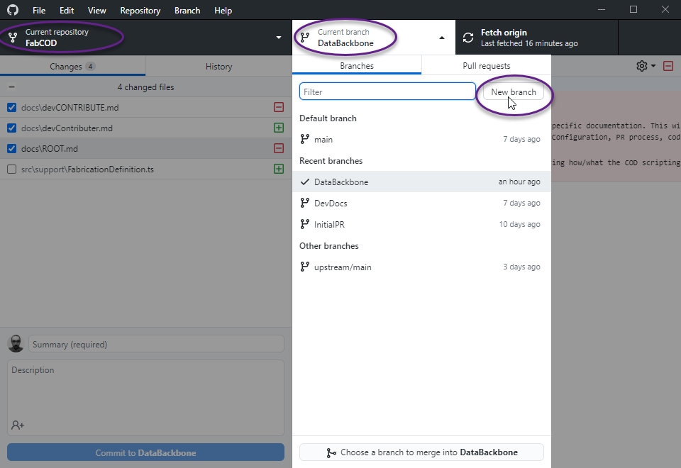
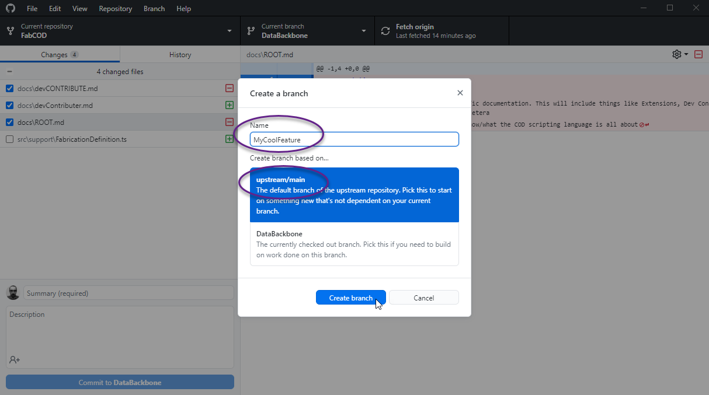

# FabCOD Extension Contributions

The FabCOD extension is designed to work with Autodesk Fabrication platform and the vast majority of people who use AutoCAD aren't necessarily used to the extremely elaborate Git Source Control System. With that said, this document will present very sequential instructions using very GUI driven tooling to accomplish very specific tasks. Please note that it is **assumed** that all instructions from the *[devReadFirst.md](https://github.com/JD-Howard/FabCOD/blob/DataBackbone/docs/devReadFirst.md)* were already completely followed, you've successfully ran the extension from the dev environment using F5 and aren't already experiencing problems. If that isn't true, please visit the [*Discussions General Area*](https://github.com/AgileBIM/FabCOD/discussions/categories/general) and create a new thread for troubleshooting help.

### Some Git Context

Git is a truly amazing source control platform, but its vast depth and command line roots do make it extremely complex; even very non-intuitive. It is helpful to conceptualize in notions of *extreme separation of concerns with a highly intelligent stitching system* to bring everything back together. Even when conflicts prevent it from automatically putting things back together, it will still give you wildly confusing ways of managing what stays and what goes.

#### Terms

- **Origin**, this refers to *your* Fork of the FabCOD repo.
- **Upstream**, this refers to the official FabCOD repo.
- **Fork**, a copy of an existing repo that maintains a relationship pointer back to the original source repo.
- **Local**, this is your actual computer and usually refers to your *physical* copy of your fork/branch.
- **Cloud**, this is distinctly different from local because this is on the GitHub server and exist forever.
- **Branch**, a divergence of the codebase from some other branch as some point in time in its history.
- **Clone**, your physical/local version of your Fork & Branch. If you switch branches the contents change.
- **Stash**, local file changes that are set aside. You can then work with the original or last commit version.
- **Stage**, this process allows you to earmark what you want to formally commit as a change to your fork.
- **Commit**, this is a *change* you've saved to your local Fork/Branch git repo.
- **HEAD**, this refers to the latest commit made on your active Fork/Branch.
- **Push**, you are communicating local *changes* (usually commits) back to your cloud Fork/Branch.
- **Pull**, you are pulling in changes from your Fork/Branch to your local.
- **Publish**, specific to branches, newly created branches don't exist in the cloud until you take this action.

- **PR** or Pull Request, this is how you communicate changes from your cloud fork back to the official repo.

Hopefully, the theme that all of these descriptions create a clear picture that you will technically be doing the vast majority of things directly to your local physical clone of whatever active branch you have. From there you still have additional steps to update your cloud fork of that same branch. From there you still have to perform another additional step to up get things back on the official repo.

**Note:** The vast majority (if not all) of the things within this tutorial showing GitHub Desktop App can also quite easily be done directly within VSCode. The GitHub Desktop App was used for the examples simply because (by comparison) it does a better job of "guiding" you through the process.

**Keep in mind:** You are effectively working offline in <u><b>every way</b></u> and explicit acts are required to change cloud resources.

## Creating a Branch

You will be performing all work on your own Fork of the base project. Within that fork, it is good practice to create a branch that represents the changes your looking to make. By creating a fresh branch of the source or *upstream main* branch (the official repo main branch) you ensure your starting from a position that is up to date with the current state of official projects code base. This is quite simple to do from within VSCode using the `Source Control Panel->Clicking ...->Branch->Create Branch From`, from there you will be prompted to name your branch and finally you'll pick the `upstream/main` as your *from* target. The following example is how you would accomplish that exact same task using the GitHub Desktop Application we advocate for.

**Note:** regardless of which GUI you use, creating a new branch still requires a publish action before it will exist in the cloud.

Image 1: You can see that the top/left of the GH App is your repo selector, the middle/top is your branch selector and the last top/right is a button tends to change changes per your current context that suggests appropriate actions. There are various ways to make a new branch but the circled *new branch* button seems pretty clear

Image 2: Here the important things are circled. First, you have to give your new branch a name. Second you need to pick baseline branch it will be derived from. There are occasions you will want to make a new branch from one of your existing ones, such as trying a completely different approach without affecting your original idea. However, more often than not, you should be starting from Upstream/Main, which is the official AgileBim/Main branch.

**Note:** This is not Shown, but after clicking *"Create Branch"*, the contextual button on the top/right (currently says fetch origin), will update to say *"Publish"*. This is trying to guide you to "finish the process" before doing work. Basically, if you don't hit publish, then you are doing 100% of the work related to that branch in the vacuum of your local machine. Which is perfectly fine if your just messing around. However, if you ever want to get the changes back to the official repo, then you will have to publish the branch.

## Committing Changes

The general principal of a commit is to save your changes in more permanent way than hitting Ctrl+S in VSCode, but committing changes is something of a tiered system. Your really only committing them locally until they are explicitly **PUSH**ed to the cloud. Whether they get pushed or not, each commit does represent a snapshot in time, that could each individually be undone. 

are all checkpoints that could be rolled back to if necessary. When you first commit a change, that change is only committed to your local clone of your Fork/Branch. You still have to PUSH those changes to update your cloud Fork/Branch. you would have to first stage changes. In the GitHub Desktop App, this is just represented with a series of checkboxes. What is checked is eligible for being committed, what isn't checked will remain a local change that is kind of in limbo.

**Note:** it generally just adds layers of confusion if you choose to "*revert*" a commit. This is because that action is also a commit. If you happened to revert an earlier commit it becomes even more difficult to visually follow what the lead up to represent the current state of the active branch. With that said, it is usually a better plan to go manually download the code (or keep a personal backup) that you then just overwrite locally and create a single commit back to prior state

## Update Fork/Branch from Upstream/Main

Before creating a PR, you are expected to be in sync with the current (official) Main branch. T

## Switching Branches

If you are actively participating in code review, it is good to note that you can access branches related to an active Pull Request. This enables you to pull in all of those preliminary changes and test them before approving the PR. The other major reason to work with multiple branches is to seperate new feature developments into small digestible pieces that will be easier to review and get approved. IE, the larger the PR, the longer it will take to get reviewed, tested, approved and implemented into the marketplace extension build.

