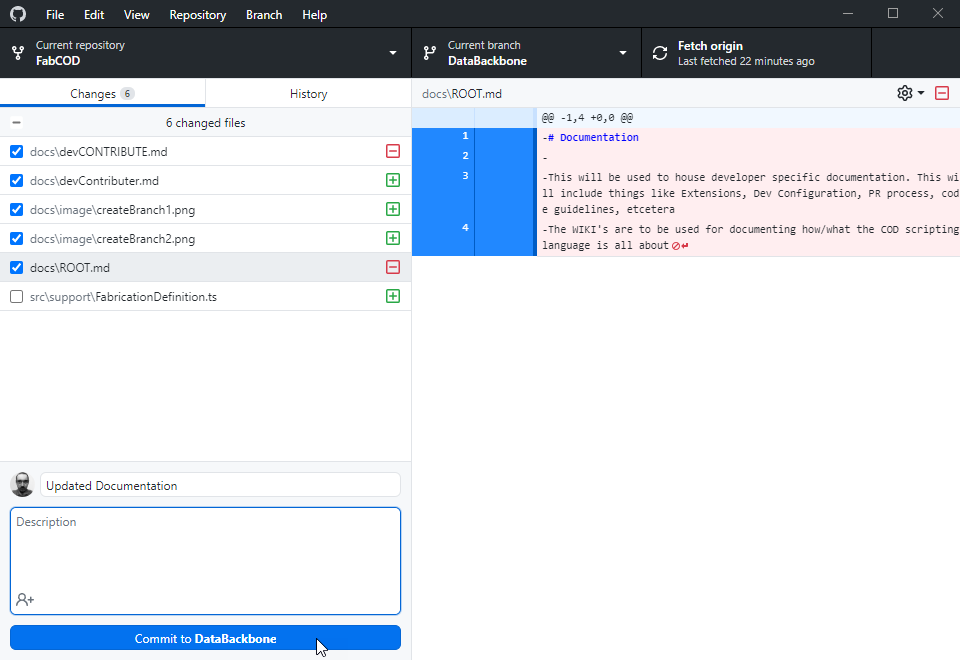
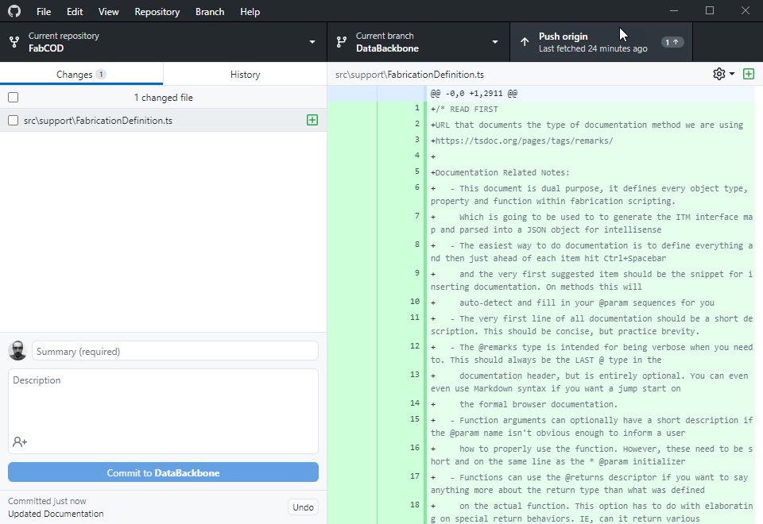
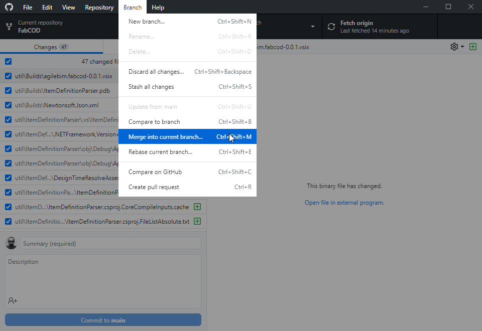
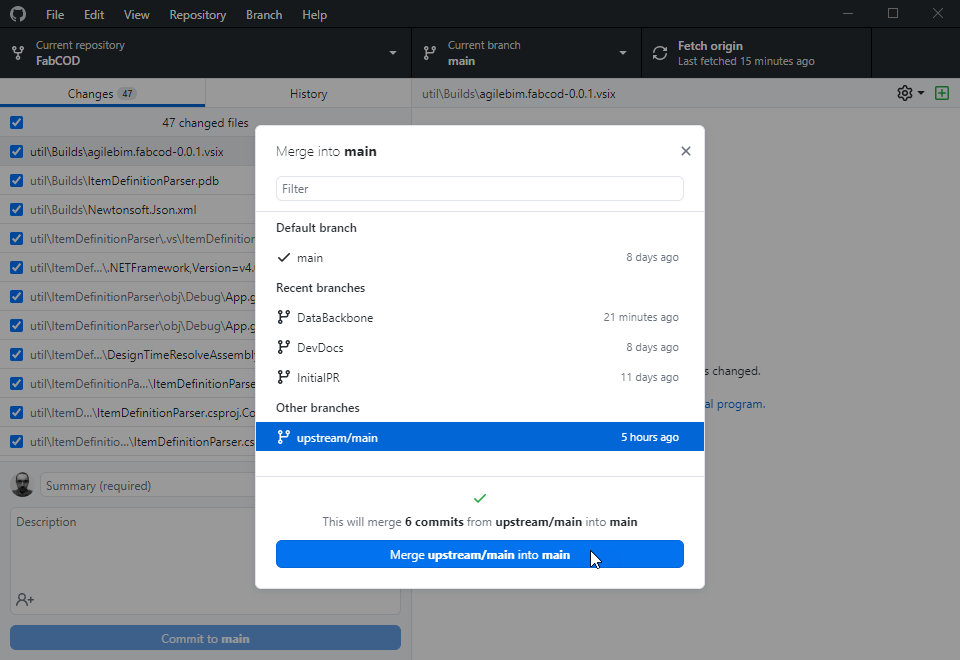
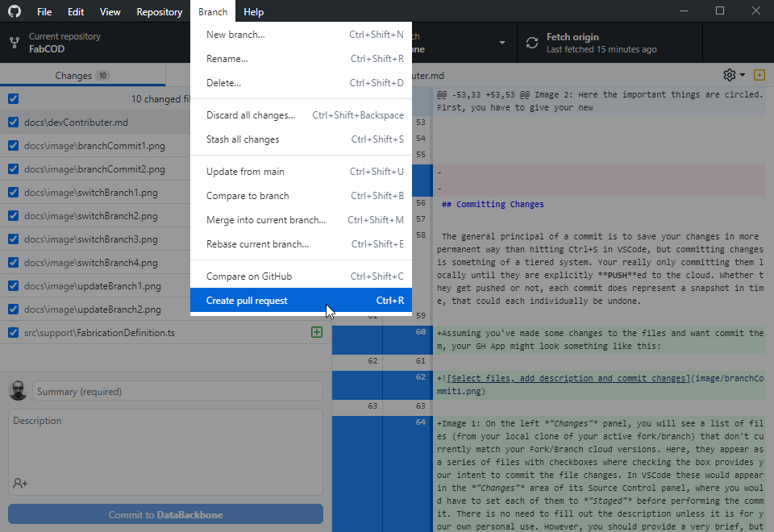
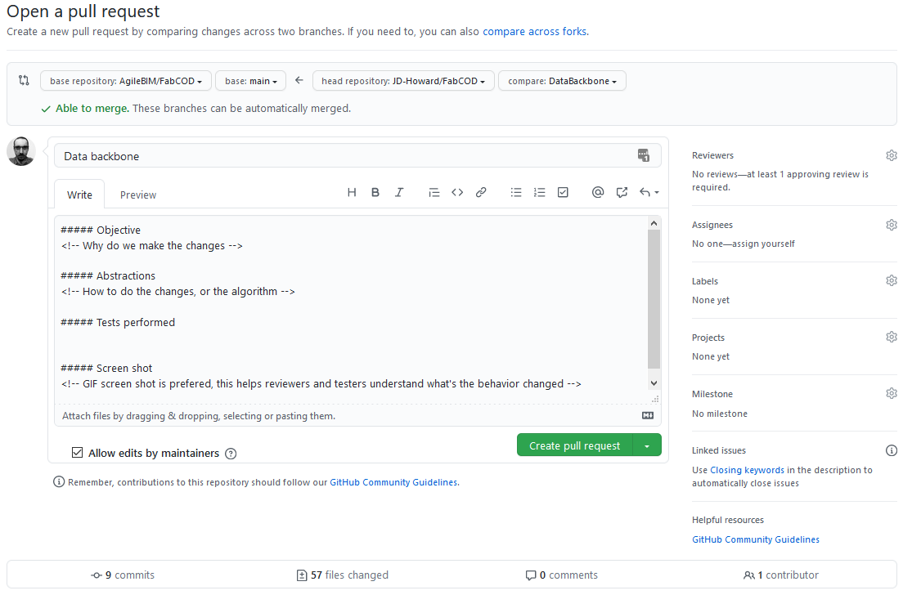
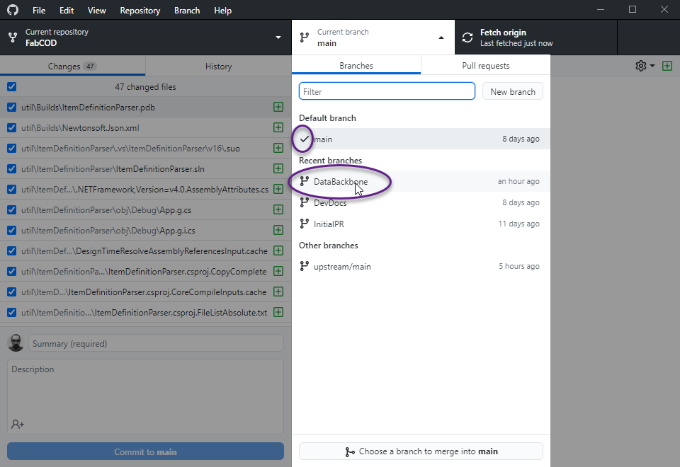
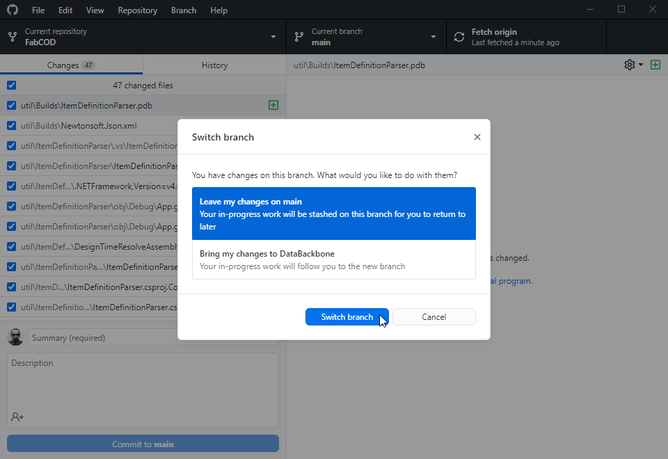
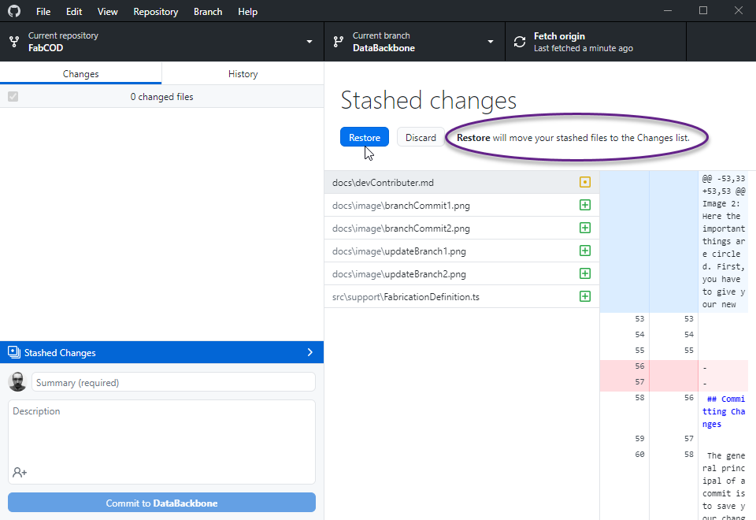

# FabCOD Extension Contributions

The FabCOD extension is designed to work with Autodesk Fabrication platform and the vast majority of people who use AutoCAD aren't necessarily used to the extremely elaborate Git Source Control System. With that said, this document will present very sequential instructions using very GUI driven tooling to accomplish very specific tasks. Please note that it is **assumed** that all instructions from the *[devReadFirst.md](https://github.com/JD-Howard/FabCOD/blob/DataBackbone/docs/devReadFirst.md)* were already completely followed, you've successfully ran the extension from the dev environment using F5 and aren't already experiencing problems. If that isn't true, please visit the [*Discussions General Area*](https://github.com/AgileBIM/FabCOD/discussions/categories/general) and create a new thread for troubleshooting help.

### Some Git Context

Git is a truly amazing source control platform, but its vast depth and command line roots do make it extremely complex; even very non-intuitive. It is helpful to conceptualize in notions of *extreme separation of concerns with a highly intelligent stitching system* to bring everything back together. Even when conflicts prevent it from automatically putting things back together, it will still give you wildly confusing ways of managing what stays and what goes.

#### Terms

- **Origin**, this refers to *your* Fork of the FabCOD repo.
- **Upstream**, this refers to the official FabCOD repo.
- **Fork**, a copy of an existing repo that maintains a relationship pointer back to the original source repo.
- **Local**, this is your actual computer and usually refers to your *physical* copy of your fork/branch.
- **Cloud**, this is distinctly different from local because this is on the GitHub server and exist forever.
- **Branch**, a divergence of the codebase from some other branch as some point in time in its history.
- **Clone**, your physical/local version of your Fork & Branch. If you switch branches the contents change.
- **Stash**, local file changes that are set aside. You can then work with the original or last commit version.
- **Stage**, this process allows you to earmark what you want to formally commit as a change to your fork.
- **Commit**, this is a *change* you've saved to your local Fork/Branch git repo.
- **HEAD**, this refers to the latest commit made on your active Fork/Branch.
- **Push**, you are communicating local *changes* (usually commits) back to your cloud Fork/Branch.
- **Pull**, you are pulling in changes from your Fork/Branch to your local.
- **Publish**, specific to branches, newly created branches don't exist in the cloud until you take this action.

- **PR** or Pull Request, this is how you communicate changes from your cloud fork back to the official repo.

Hopefully, the theme that all of these descriptions create a clear picture that you will technically be doing the vast majority of things directly to your local physical clone of whatever active branch you have. From there you still have additional steps to update your cloud fork of that same branch. From there you still have to perform another additional step to up get things back on the official repo.

**Note:** The vast majority (if not all) of the things within this tutorial showing GitHub Desktop App can also quite easily be done directly within VSCode. The GitHub Desktop App was used for the examples simply because (by comparison) it does a better job of "guiding" you through the process.

**Keep in mind:** You are effectively working offline in <u><b>every way</b></u> and explicit acts are required to change cloud resources.

## Creating a Branch

You will be performing all work on your own Fork of the base project. Within that fork, it is good practice to create a branch that represents the changes your looking to make. By creating a fresh branch of the source or *upstream main* branch (the official repo main branch) you ensure your starting from a position that is up to date with the current state of official projects code base. This is quite simple to do from within VSCode using the `Source Control Panel->Clicking ...->Branch->Create Branch From`, from there you will be prompted to name your branch and finally you'll pick the `upstream/main` as your *from* target. The following example is how you would accomplish that exact same task using the GitHub Desktop Application we advocate for.

**Note:** regardless of which GUI you use, creating a new branch still requires a publish action before it will exist in the cloud.

Image 1: You can see that the top/left of the GH App is your repo selector, the middle/top is your branch selector and the last top/right is a button tends to change changes per your current context that suggests appropriate actions. There are various ways to make a new branch but the circled *new branch* button seems pretty clear

Image 2: Here the important things are circled. First, you have to give your new branch a name. Second you need to pick baseline branch it will be derived from. There are occasions you will want to make a new branch from one of your existing ones, such as trying a completely different approach without affecting your original idea. However, more often than not, you should be starting from Upstream/Main, which is the official AgileBim/Main branch.

**Note:** This is not Shown, but after clicking *"Create Branch"*, the contextual button on the top/right (currently says fetch origin), will update to say *"Publish"*. This is trying to guide you to "finish the process" before doing work. Basically, if you don't hit publish, then you are doing 100% of the work related to that branch in the vacuum of your local machine. Which is perfectly fine if your just messing around. However, if you ever want to get the changes back to the official repo, then you will have to publish the branch.

## Committing Changes

The general principal of a commit is to save your changes in more permanent way than hitting Ctrl+S in VSCode, but committing changes is something of a tiered system. Your really only committing them locally until they are explicitly **PUSH**ed to the cloud. Whether they get pushed or not, each commit does represent a snapshot in time, that could each individually be undone. 

Assuming you've made some changes to the files and want commit them, your GH App might look something like this:

Image 1: On the left *"Changes"* panel, you will see a list of files (from your local clone of your active fork/branch) that don't currently match your Fork/Branch cloud versions. Here, they appear as a series of files with checkboxes where checking the box provides your intent to commit the file changes. In VSCode these would appear in the *"Changes"* area of its Source Control panel, where you would have to set each of them to *"Staged"* before performing the commit. There is no need to fill out the description unless it is for your own personal use. However, you should provide a very brief, but meaningful description of what this commit represents. Finally click *"Commit to YourBranchName"* and those changes will be wrapped into a commit locally.

**Note:** the top 2 checked entries show you what it looks like when a file gets renamed. The first one is deleted and the second one is a brand new filed. Not shown, a changed file would be a box with a dot in it.

Image 2: You can see that the lower/left says we just created the commit, you'll notice we only have the unchecked file in our changes panel and that the contextual button updated to say *"Push Origin"* for us. At this point that commit only exists locally, we still have to **PUSH** those changes to update our own personal Fork/Branch with that same commit data.

**Note:** it generally just adds layers of confusion if you choose to "*revert*" a commit. This is because that action is also a commit. If you happened to revert an earlier commit it becomes even more difficult to visually follow what the lead up to represent the current state of the active branch. With that said, it is usually a better plan to go manually download the code (or keep a personal backup) that you then just overwrite locally and create a single commit back to prior state

## Update Fork/Branch from Upstream/Main

Now that we've created a branch, made changes, committed those changes and might be looking to communicate our changes back to the main project, ask yourself what's happened in the days or weeks you were building out some new feature? 

Well, the code may be in the same state, but it could also be many commits beyond where your branch originally derived. So, we want to pull in all the current changes before creating a PR and test our new features again before we actually create a new feature PR on the official repo. To do this is very easy, but depending on how far behind you've become, the risk of merge conflicts gets higher, but lets try:

Image 1: For this example I've switched to **my** Forks **Main** branch which is now many commits behind the Upstream/Main and my DataBackbone branch which has issued multiple PRs. That crazy list of + files on the left are items that now exist in my local folder that it wasn't tracking and thus didn't remove or restore them and it is our hope that this merge process will legitimize most of them. Using the menu bar, go to `Branch->Merge Into Current Branch` or use the `Ctrl+Shift+M` shortcut.

Image 2: By selecting the Upstream/Main, we are essentially saying we want to import whatever commits the official FabCOD repo has. This will put us in alignment with that repo, but still keep our changes too. Select merge and hope that you haven't been changing the exact same code someone else. If there is a conflict, there are very confusing questions you'll get asked. Keep in mind that HEAD is your latest commit on your Fork/Branch. If you are confident and it is presented as an option, you can essentially tell it to disregard the conflict by keeping your version. Alternatively you can manually edit merged file with both changes along side each other and pick the parts that you want to keep. For more information on that process you'll have to do some reading [somewhere else](https://web.archive.org/web/20201028110933/https://www.git-tower.com/learn/git/ebook/en/desktop-gui/advanced-topics/merge-conflicts/).

**Note:** Merging the commits from the Upstream/Main puts your local repo in a state aligned with that branch, but again, we still have to **PUSH** those changes to our cloud fork by pressing the contextual top/right button saying *"Push Origin"*.

## Creating a Pull Request

For this I've switched back to my DataBackbone Branch that we committed and pushed changes from.

Image 1: You can initiate a Pull Request using the menu bar. `Branch->Create Pull Request` or using the `Ctrl+R` keyboard shortcut. This action will direct you to a web interface; which is normal and the only way to perform this action.

Image 2: From top to bottom, this webpage will show you Forks/Branches involved and the direction of the flow of information. Below that it gives you a clear indicator that it can be merged and if you regularly follow the prior step of getting updated with Upstream/Main, then you can always expect this to be green. Below that is the description of your PR, this needs to be brief but clearly indicate the intent of the PR. Below that is information you need to fill out, but if one of the sections do not apply, just delete it; this is **not** the place for brevity, please be verbose. Also note that the bracketed areas are invisible comments to help you and they can also be deleted. Once all the information is filled out and you've reviewed the changes your committing, you can click Create Pull Request and you'll have a PR on the official FabCOD Pull Requests area.

**Note:** Once you've created a PR, if you are asked to make changes further commits automatically get applied to the PR while it is open. Once the PR is approved/merged, you can add more commits to that branch, but they no longer will be directed to the PR. So at that point, you would have to make a new PR for the additional commits to get them on the official repo.

# Appendix

There are many more useful tools and behaviors in the GitHub space. Below are a few random things that will help you navigate and be successful with git repo's.

## Switching Branches

If you are actively participating in code review, it is good to note that you can access branches related to an active Pull Request. This enables you to pull in all of those preliminary changes and test them before approving the PR. The other major reason to work with multiple branches is to separate new feature developments into small digestible pieces that can operate independently of each other. Which will be easier to review and get approved. IE, the larger the PR, the longer it will take to get reviewed, tested, approved and implemented into the marketplace extension build.

To switch branches, just open up your GH App and use the branch selector:

Image 1: This chain of actions is **from** my badly behind Main branch going back **to** DataBackbone.

Image 2: This dialog is asking what to do with those 47 changed files. In most cases, the default option of leaving them behind is the correct action. That will automatically put them into a *"Stash"* which means they aren't gone, but they won't be available in the branch or switching to either. Bringing them with you is an option, but the GH App doesn't let you be selective in this and  is probably more hassle than its worth or even dangerous if the branch your switching to also has changes to that file; IE, a merge conflict.

Image 3: Once your on the destination branch, if it has new or edited files that weren't committed, then they should be sitting in a stash. You could leave them there, but it is recommended you restore them and continue to work with your full deck of cards even if you don't want to commit some of them.

Image 4: Clicking restore will bring all your changes back, if you don't do this final step, then they remain in the stash and any work you do on the repo could wind up creating conflicts between your active files and your stashed versions; which is very bad and not something I can help you resolve.