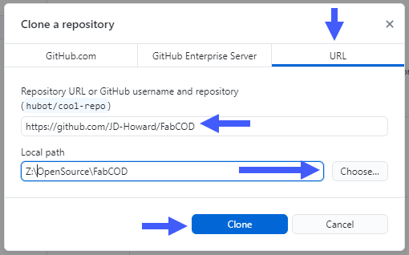

# Developer Setup

Follow all of these steps to be capable of cloning the repo, compile and/or debug this VSCode extension. Please note that this is a full life cycle introduction to contributing to the project. If you are simply playing with the code in a non-contributor context, then only follow the steps with a :heavy_check_mark: suffix.

## Step 0: Request Invite

Visit the discussion [General](https://github.com/AgileBIM/FabCOD/discussions/4) topic to request access to the repository.

## Step 1: Prerequisites :heavy_check_mark:

If you know you've already installed any of these *required* prerequisites then you shouldn't need to do them again. The notable exception to that might be NodeJS, if your version is < 10. Note that you can type 

​	`node -v` 

into a Powershell console to find our your currently installed version; if any...

#### Required Software

- Install the latest [NodeJS](https://nodejs.org/en/download/) LTS 64-bit version for your respective OS
- Install the latest version of [Python3](https://www.python.org/downloads/) for your respective OS
- Install the latest version of [Visual Studio Code](https://code.visualstudio.com/Download) for your respective OS

#### Recommended Software

These programs are not necessary to have, but are very helpful and may be used as the only example in the steps detailed below.

- **[Typora:](https://typora.io/)** this fantastic open source Markdown editor was used to write this document. If you are contributing source code to the project, then you can expect requests to document new features in markdown files or at least update existing MD files (like the changelog) in some capacity.

- [**GitHub Desktop:**](https://desktop.github.com/)  you can use VSCode's integrated source control interfaces to do anything you can't directly do on the Web UI, but this is a nice addition and our documentation and examples will be using this application to simplify the process.

## Step 2: Create a Fork

All modifications to the **AgileBIM-FabCOD** project will be handled through Pull Requests from your own Fork of the project. So, once you have been given access, you will then need to create your own fork of the project. If you are not familiar with how to fork a project, then watch the first 2:45 of [this video](https://www.youtube.com/watch?v=ggP3jBpWZwQ).

That video is very dry, slow moving and mildly out of date with the current GitHub web UI, but I do think it is very good at explaining what a Fork is and (if you watch the whole thing) what pull requests are, but in very simple/clear terms. 

## Step 3: Clone the Repo :heavy_check_mark:

Cloning your repository locally can be done in many different ways, but I prefer to accomplish this using the [GitHub Desktop](https://desktop.github.com/) application. The instructions below make the assumption you will be contributing to the main project, if you are only tinkering with the code, then just use the Web UI to download a zip/extract it wherever you want.

From GHD, goto `File` -> `Clone Repository` or use the `Ctrl+Shift+O` shortcut. Which will bring up this dialog:

- From **your** fork of the FabCOD project in the Web UI , copy the URL and paste it into the 
  	`URL Tab` -> `Repository URL Field` 
  as shown above using my **JD-Howard** fork as an example. 
- Set your `Local Path` where you want to locally clone the project to. Note, if you use the choose button, then your specifying the root folder of where the `FabCOD` folder will be located.
- `Click Clone`, you will be prompted whether you want to contribute changes back to the forks parent project. If you are planning to contribute on the project, then the answer is yes and that should be the default selected item.

## Step 4: VSCode Extensions

If you are going to contribute to the project, then you should install the following extensions:

| Extension Name                | Publisher     | Requirement |
| :---------------------------- | ------------- | :---------: |
| npm                           | Egamma        |  Required   |
| TSLint                        | Egamma        |  Required   |
| Error Lens                    | Alexander     |  Required   |
| GitHub Pull Requests & Issues | GitHub        |  Required   |
| Git History                   | Don Jayamanne | Recommended |
| Git Lens                      | Eric Amodio   | Recommended |
| Prettier Code Formatter       | Prettier      | Recommended |

**Note:** If you already had the FabCOD extension installed, it is suggested that you uninstall it until after you've verified everything else described in this documentation appears functional.

## Step 5: VSCode Terminal Commands :heavy_check_mark:

After installing all prerequisites and if not already open, you can find the VSCode terminal by using the ``Ctrl+` ``  shortcut.  There are various types of terminals that can be activated, we recommend using Powershell version. If the combo box does not show Powershell, then you can use the `Select Default Shell` option within to specify Powershell. Once done, you can execute the following commands in that Powershell terminal

* `npm install` to download and install all the package.json dependencies
* `npm install -g vsce`  The first command installs vsce, but Microsoft recommends installing this one globally.

## Step 6: Launch or Test Extension :heavy_check_mark:

At this point your ready to *"do something"* with the extension. If you are tinkering and just want to run the extension, press `F5` and select the `Run Extension` options from the Command Palette. Anyone wanting to contribute should understand the 2 different launch types and how to compile a VSIX that could be installed as an extension. The following launch types can be accessed from the `Run` palette and can also be brought up using `Ctrl+Shift+D`

- **Run Extension**, this is how you will debug the application in the same way an end user would interact with the installed version.  If you place breakpoints in the code (and that code actually gets executed) then it will stop and let you step through that area. Do note that TypeScript is a superscript of JavaScript and that makes them both often very asynchronous. Which basically means, when you see something get called, that doesn't mean it immediately does stuff or has the proper context to inspect end-result variables. You'll have to figure out where breakpoints make the most sense to obtain your expected context.
- **Extension Tests**, this literally executes only the scripts defined in `./src/test/suite/` folder and then closes the application. It is the goal of this project to have a "decent" amount of test coverage for all shared or critical project features. There is a good chance an RP comment will be to create a test case for some or all of your RP. Testing is a good practice and it benefits everyone (even you) so please make at least rudimentary tests for things your submitting. If they aren't meaningful tests that we would want to persist, then they don't need to be staged/committed to the PR, but you can at least talk about them in the PR submission notes. 

## Step 7: Building a VSIX

There are multiple ways to accomplish building a VSIX file, but easiest way is to use the `pack.py` file located in the root of the project. 

- Open the pack.py file. 

- You may be prompted to install a python extension, go ahead and accept their suggestion because Python is not a major part of this library. 

- Once the python extension is fully loaded, you should should be able to 

  ​		`right click` -> `Run Python File in Terminal`
  from anywhere in the document body.

- If it didn't spit out errors and you get this message:
  *It created fabcod.vsix file sucessfully*
  then you should have an up to date fabcod.vsix file in the root of the cloned project.

- You can install this VSIX file from the workspace file explorer by

  ​		`Right Click fabcod.vsix` -> `Install Extension VSIX` 

  Once installed, anytime VSCode opens a COD file (expect when using methods described in Step 5) it will use the FabCOD extension you compiled. This is a suggested way to do final testing just before making a PR.

## :gift: Contributing :gift:

If you plan to contribute to the project, then please continue reading in the [CONTRIBUTORS.md](CONTRIBUTORS.md)

